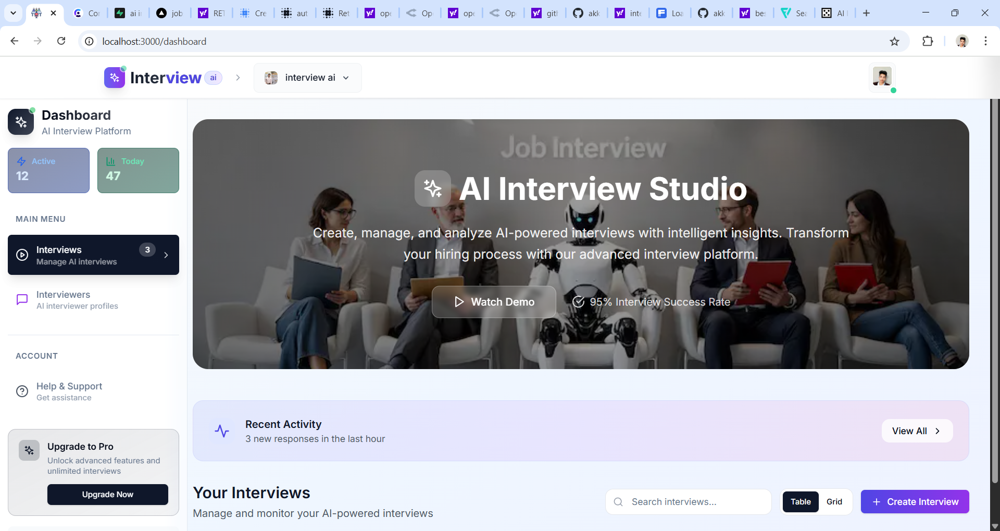
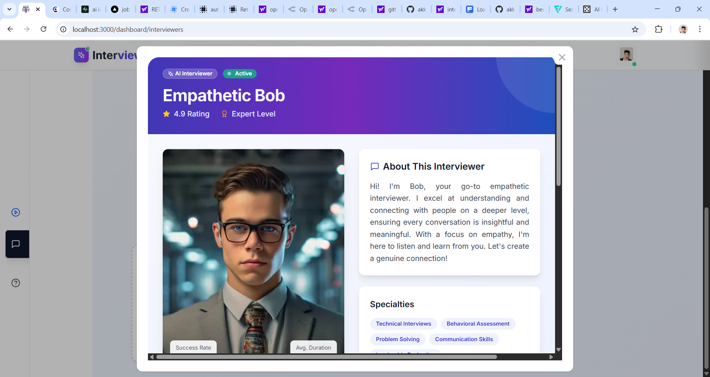
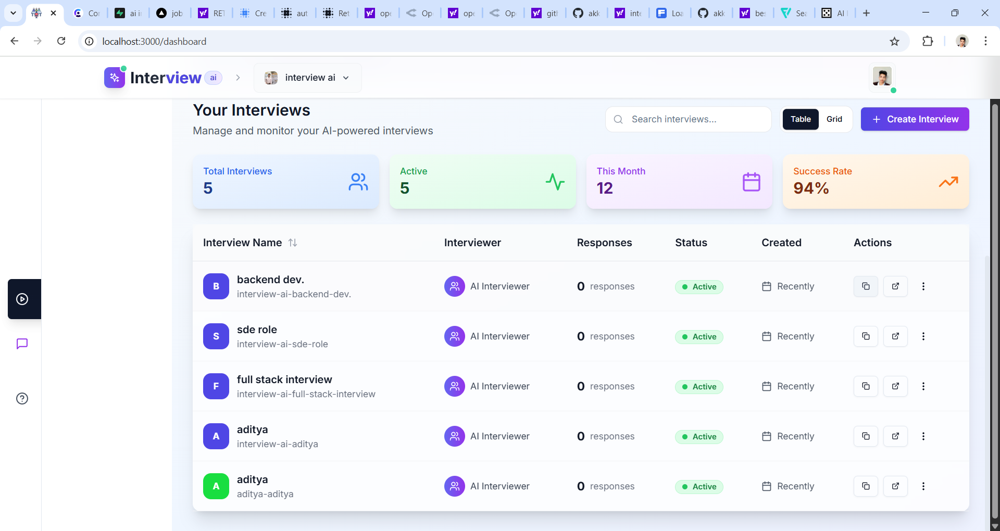
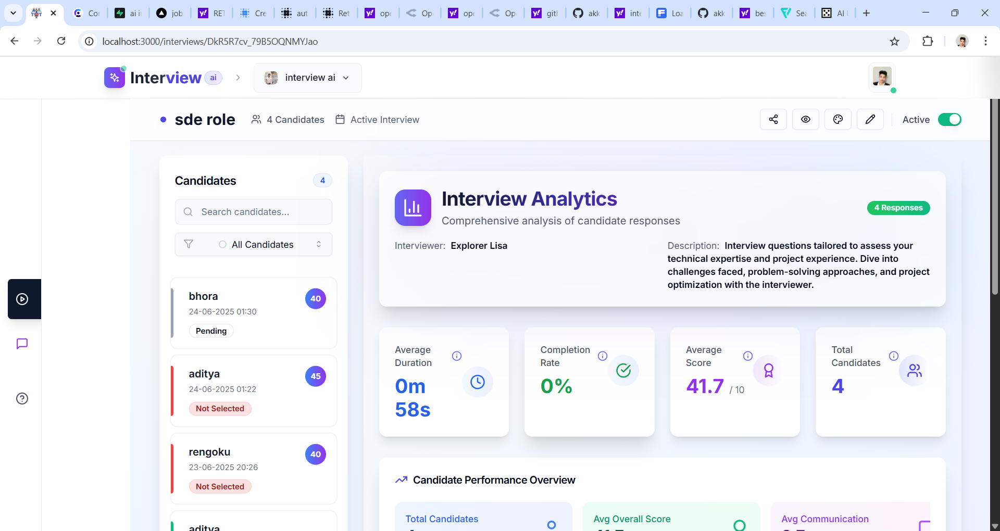
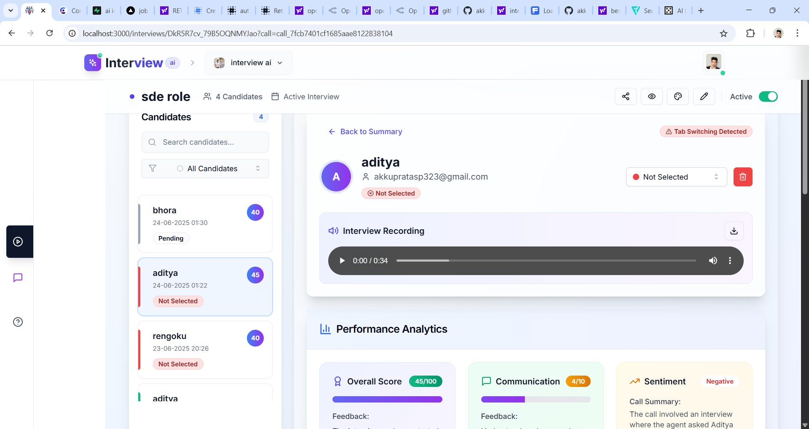
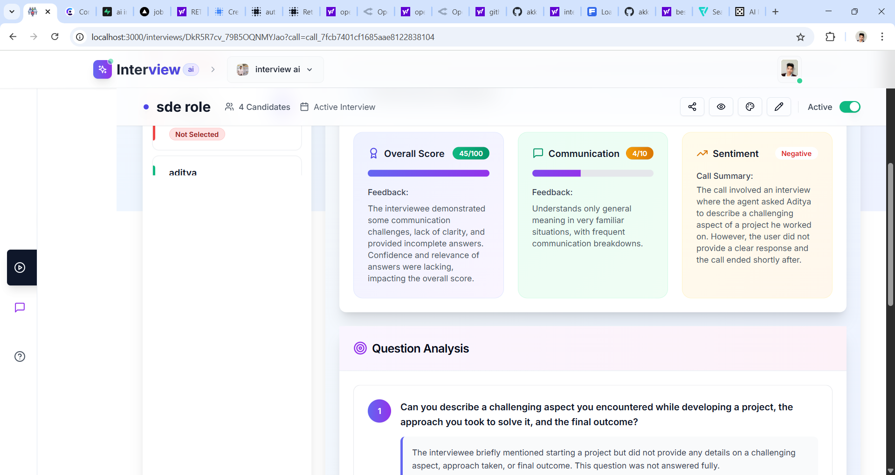
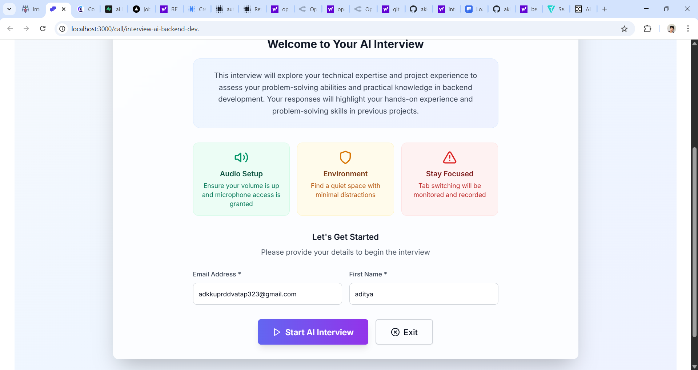
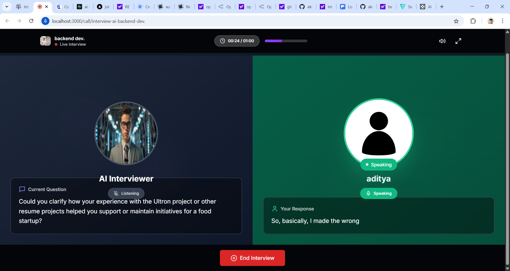

# Interview AI

Interview AI is a modern, AI-powered interview platform that helps organizations create, manage, and analyze interviews with intelligent insights. Built with Next.js, Supabase, and OpenRouter (OpenAI-compatible), it enables automated candidate evaluation, interviewer management, and advanced analytics for hiring teams.

## Screenshots

|  |  |
|:------------------------------:|:------------------------------:|
|  |  |
|  |  |
|  |  |

## Features

- **AI-Powered Interviews:** Generate and conduct interviews with AI interviewers (e.g., Bob, Lisa) tailored to your needs.
- **Custom Interview Creation:** Easily create interviews with custom questions, objectives, and durations.
- **Candidate Response Analytics:** Get instant AI-generated analytics, including overall and communication scores, sentiment analysis, and more.
- **Interviewer Management:** Add, view, and manage AI interviewers with detailed profiles and specialties.
- **Dashboard & Insights:** Visualize candidate performance, interview stats, and key metrics with beautiful charts and tables.
- **Modern UI:** Responsive, accessible, and visually appealing interface with hover-to-expand side menu and modals.
- **Authentication & Organization:** Secure sign-in, organization management, and role-based access via Clerk.
- **Dockerized & Cloud-Ready:** Easily deployable with Docker and compatible with cloud platforms.

## Tech Stack

- **Frontend:** Next.js 14, React, Tailwind CSS, Lucide Icons
- **Backend:** Next.js API routes, Supabase (Postgres), OpenRouter (OpenAI-compatible API)
- **Authentication:** Clerk
- **Deployment:** Docker, Vercel, or any cloud provider

## Getting Started

1. **Clone the repository:**
   ```sh
   git clone https://github.com/your-org/interview-ai.git
   cd interview-ai
   ```
2. **Install dependencies:**
   ```sh
   yarn install
   # or
   npm install
   ```
3. **Set up environment variables:**
   - Copy `.env.example` to `.env` and fill in your Supabase, Clerk, and OpenRouter API keys.
4. **Run locally:**
   ```sh
   yarn dev
   # or
   npm run dev
   ```
5. **Build and run with Docker:**
   ```sh
   docker build -t interview-ai .
   docker run -p 3000:3000 interview-ai
   ```

## Folder Structure

- `src/app/` — Next.js app directory (pages, layouts, API routes)
- `src/components/` — UI components (dashboard, interview, interviewer, modals, etc.)
- `src/services/` — API and database service logic
- `src/contexts/` — React context providers for state management
- `src/types/` — TypeScript types
- `public/` — Static assets (images, audio, icons)

## Customization

- **Add Interviewers:** Use the dashboard to add new AI interviewers with custom images, audio, and specialties.
- **Edit Interview Flows:** Modify `src/components/dashboard/interview/createInterviewModal.tsx` and related files for custom interview creation steps.
- **Update Analytics:** Adjust AI analytics prompts in `src/lib/prompts/analytics.ts` to change how scores and insights are generated.

## Contributing

Contributions are welcome! Please see [CONTRIBUTING.md](CONTRIBUTING.md) for guidelines.

## License

This project is licensed under the MIT License. See [LICENSE](LICENSE) for details.

---

**Interview AI** — Revolutionize your hiring process with AI-driven interviews and analytics.
